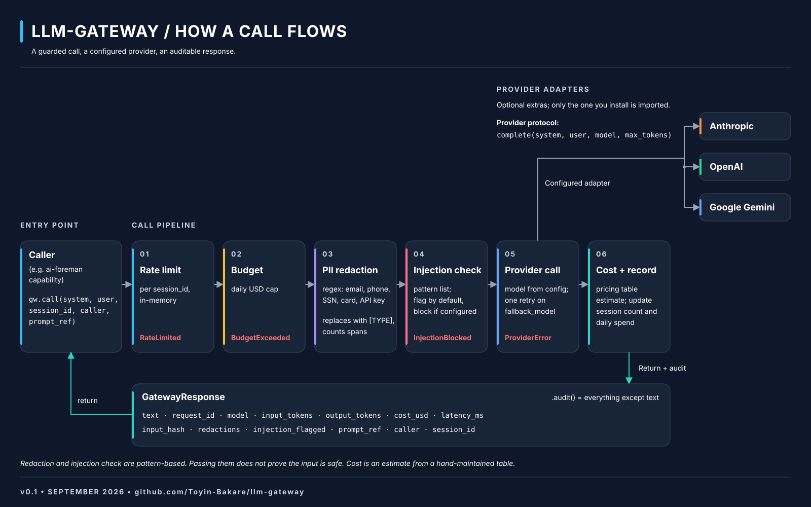

# llm-gateway

One `call()` to a language model, with the governance done for you:
provider routing, PII redaction, prompt-injection check, per-session rate limit,
daily budget, and every field an audit record needs.

Built as a dependency for [ai-foreman](https://github.com/Toyin-Bakare/ai-foreman).
Also works on its own.

## How a call flows



```
limits → redact → injection check → provider (one fallback) → cost → record → response
```

## Install

```bash
pip install "llm-gateway[anthropic]"   # or [openai], [google], [all]
```

Until it's on PyPI:

```bash
pip install "llm-gateway[all] @ git+https://github.com/Toyin-Bakare/llm-gateway"
```

## Use

```python
from llm_gateway import Gateway, GatewayConfig

gw = Gateway(GatewayConfig(
    provider="anthropic",            # "anthropic" | "openai" | "google"
    model="claude-sonnet-4-5",
    fallback_model=None,
    max_tokens=1024,
    rate_limit_per_session=20,
    daily_budget_usd=5.00,
    redact_pii=True,
    injection_check=True,
    block_on_injection=False,        # flag by default; set True to raise
))

resp = gw.call(
    system="You triage CI failures.",
    user="pytest failed on line 42 ...",
    session_id="abc123",
    caller="ai-foreman/triage",
    prompt_ref="triage@1.2.0",
)

print(resp.text)
print(resp.audit())   # everything except the text, ready to log
```

API keys come from the usual env vars (`ANTHROPIC_API_KEY`, `OPENAI_API_KEY`,
`GOOGLE_API_KEY`) or `GatewayConfig(api_key=...)`.

## What comes back

| Field | Meaning |
|---|---|
| `text` | Model output |
| `request_id` | Unique per call |
| `model` | Model that actually answered (may be the fallback) |
| `input_tokens`, `output_tokens` | From the provider |
| `cost_usd` | Estimate from `pricing.py` |
| `latency_ms` | Provider round-trip |
| `input_hash` | sha256 of redacted system + user text |
| `redactions` | PII spans replaced |
| `injection_flagged`, `injection_hits` | Pattern check result |
| `prompt_ref`, `caller`, `session_id` | Echoed from the call |

## Errors

Typed, not strings: `RateLimited`, `BudgetExceeded`, `InjectionBlocked`, `ProviderError`.
All subclass `GatewayError`.

## Pipeline

```
limits → redact → injection check → provider (one fallback) → cost → record → response
```

## What v0.1 is and is not

- **PII redaction is regex.** It catches emails, phones, SSNs, card numbers, and
  common API-key shapes. It is not a full PII detector.
- **Injection check is pattern-based.** It flags likely attempts. Passing it does
  not prove the input is safe.
- **Limits are in-memory.** Fine for one process. `MemoryLimits` has a small
  interface so SQLite or Redis can replace it.
- **Cost is an estimate.** `pricing.py` is hand-maintained with a `LAST_VERIFIED`
  date. Unknown models cost 0.0 — add them to the table.
- **No network in tests.** Tests use a fake provider.

## Develop

```bash
pip install -e ".[dev]"
ruff check src tests
pytest -q
```

## Roadmap (not v1)

Persistent limits, LLM-based injection scoring, streaming, async, retries with
backoff, provider-side guardrails.

## License

MIT
